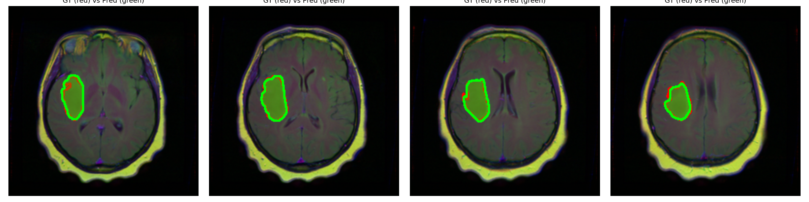
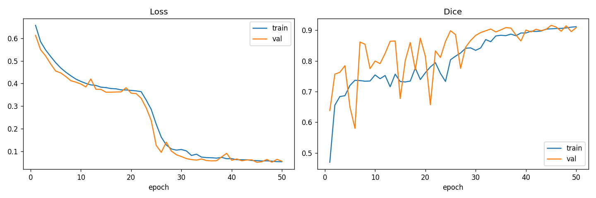

# Brain MRI Tumor Segmentation (U-Net)

A U-Net that contours lower-grade glioma in brain MRI — built from scratch in PyTorch and scoring **0.914 Dice on held-out patients the model never saw during training**.

I work on clinical ML, so I wanted a clean, end-to-end version of the step that actually matters in radiology: turning a scan into a structured region a clinician can act on. The model takes a FLAIR MRI slice, predicts a per-pixel tumor mask, and draws the contour back onto the image.

### Example output

Held-out test slices — radiologist ground truth in red, model prediction in green:





## Results

Trained for 50 epochs on a single GPU; the saved checkpoint is the best epoch by validation Dice. The train/validation/test split is done at the **patient** level rather than the slice level, so the test numbers reflect performance on people the model never encountered.

| Split | Dice | IoU |
|-------|------|-----|
| Validation | 0.916 | 0.885 |
| Test | 0.914 | 0.885 |

The gap between validation and test is essentially zero — which is the number I care about most. It means the network learned what a tumor looks like rather than memorizing slices.

## How it works

A standard U-Net — a ~31M-parameter encoder/decoder where skip connections carry fine spatial detail from the downsampling path straight into the upsampling path, which is what keeps the predicted boundary crisp. Input is the three co-registered MRI sequences (pre-contrast, FLAIR, post-contrast); output is a single binary tumor mask.

Three decisions did most of the work:

- **Patient-level splitting.** Neighboring MRI slices are near-duplicates. Split them at random and the same brain ends up in both train and test — your Dice looks great for the wrong reason. Assigning whole patients to a single split is the difference between an honest metric and a misleading one.
- **BCE + Dice loss.** Tumor pixels are a small minority of every slice, so a plain pixel-wise loss happily predicts "all background" and scores high. Pairing binary cross-entropy with a Dice term keeps the rare positive pixels driving the gradient.
- **Augmentation** — flips, rotations, grid distortion, brightness/contrast — to stretch ~110 patients into something the network won't overfit.

The full architecture walkthrough, and the things that bit me along the way, are in [`docs/how-it-was-built.md`](docs/how-it-was-built.md).

## Why this matters

Contouring — outlining a structure on a scan — is manual, slow, and a genuine bottleneck in radiology and radiation-oncology workflows. A model that proposes the contour isn't there to replace the clinician; it hands them a starting point to accept or correct. That's the pattern I build toward in clinical work: put the model inside the workflow and keep the human in the loop.

## Dataset

[Brain MRI segmentation](https://www.kaggle.com/datasets/mateuszbuda/lgg-mri-segmentation) (Buda et al.), from the TCGA lower-grade glioma collection — ~110 patients, ~3,900 slices of 256×256 TIFFs with expert binary tumor masks. The data is pulled separately (see below) and is not committed to the repo.

## Run it yourself

**Colab (free GPU)** — open [`notebooks/train_colab.ipynb`](notebooks/train_colab.ipynb), set the runtime to GPU, and run top to bottom. It installs dependencies, loads the dataset, trains, plots curves, draws prediction overlays, and exports the weights.

**Locally:**

```bash
pip install -r requirements.txt

# dataset (needs a Kaggle API token at ~/.kaggle/kaggle.json)
python scripts/download_data.py --out data

# train
python -m src.train --data-dir data/lgg-mri-segmentation \
    --epochs 50 --batch-size 16 --lr 1e-4 --out runs/exp1

# predict on one slice
python -m src.inference --weights runs/exp1/best_model.pt \
    --image path/to/slice.tif --out prediction.png
```

To sanity-check the pipeline with no data at all, `python -m src.train --smoke-test --out runs/smoke` runs the whole loop on synthetic tensors in a few seconds.

## What's in here

```
src/
  model.py        U-Net architecture
  data.py         dataset, patient-level split, augmentation
  losses.py       BCE+Dice loss, Dice/IoU metrics
  train.py        training loop (CLI), mixed precision, checkpointing
  inference.py    load checkpoint -> predict -> contour overlay
  utils.py        seeding, checkpoints, overlay rendering
scripts/          Kaggle download helper
notebooks/        end-to-end Colab training notebook
docs/             architecture and design write-up
app/              interactive demo (in progress)
```

## Roadmap

- [x] U-Net training pipeline, patient-level evaluation, Colab notebook
- [x] Inference + contour-overlay API
- [ ] Interactive web demo — upload a slice, get the contour back (Gradio on Hugging Face Spaces)
- [ ] Pretrained-encoder backbone for a few more Dice points
- [ ] ONNX export for in-browser inference

## A note on scope

Research and education only. This is not a medical device and nothing here is cleared for clinical use.

## References

- Ronneberger, Fischer, Brox. *U-Net: Convolutional Networks for Biomedical Image Segmentation.* MICCAI 2015.
- Buda, Saha, Mazurowski. *Association of genomic subtypes of lower-grade gliomas with shape features automatically extracted by a deep learning algorithm.* Computers in Biology and Medicine, 2019.

## License

MIT — see [LICENSE](LICENSE).
